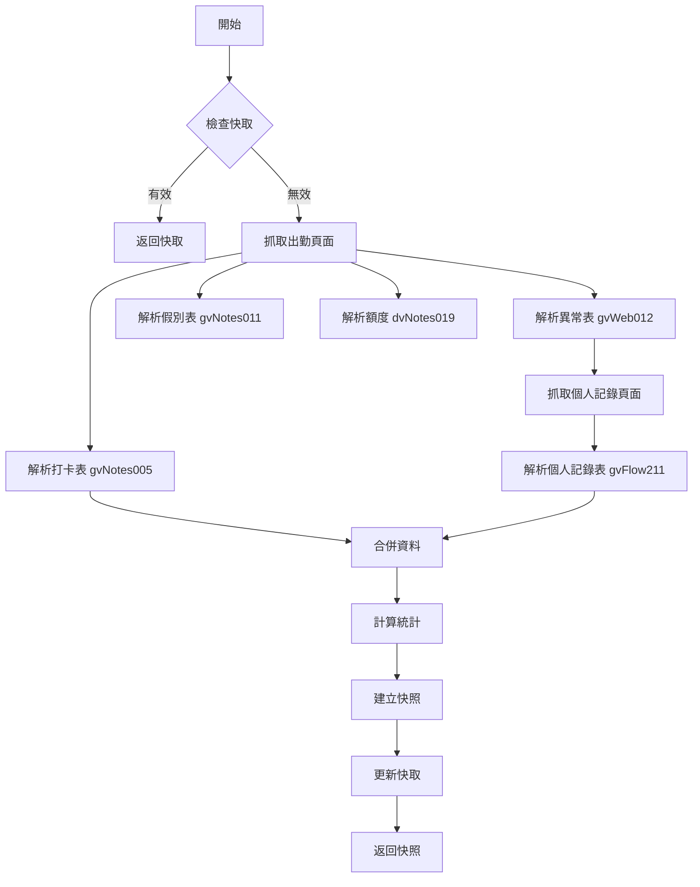
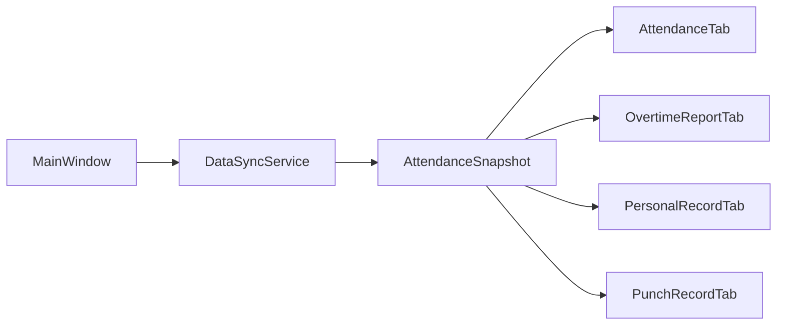

# 資料同步機制設計

## 概述

`DataSyncService` 是 v1.3.0 引入的統一資料同步服務,取代了過去分散的資料抓取邏輯,提供更高效、更一致的資料管理方案。

## 設計目標

### 問題背景

**v1.2.0 及之前版本的問題**:

1. **重複抓取**: 相同資料從不同頁面重複取得

   - 個人記錄查詢 (FW21003Z.aspx) - 2 次重複請求
   - 出勤異常清單 (FW99001Z.aspx) - 1 次請求
   - 加班狀態查詢 - 與個人記錄相同頁面,重複抓取

2. **資料耦合**: 多個資料模型描述相同概念

   - `AttendanceRecord` - 僅包含日期、時間
   - `OvertimeSubmissionRecord` - 包含日期、時數、內容
   - `SubmittedRecord` - 包含日期、狀態、時數
   - `PersonalRecord` - 包含日期、內容、狀態、累計

3. **效能問題**: 分別請求增加網路開銷

   - 登入後 5 次 HTTP 請求
   - 無快取機制,每次重新整理都重新抓取

4. **資料不一致**: 不同來源的相同資料可能不同步

### 改進目標

- ✅ **減少 HTTP 請求**: 從 5 次降至 3 次 (40%)
- ✅ **統一資料模型**: 單一來源 (`AttendanceSnapshot`)
- ✅ **智慧快取**: 5 分鐘 TTL,避免重複請求
- ✅ **資料一致性**: 所有 UI 從相同快照讀取
- ✅ **Stale-on-error**: 網路錯誤時返回舊快取

## 資料模型

### 核心模型

```python
@dataclass
class AttendanceSnapshot:
    """出勤資料快照 - 所有資料的統一來源"""

    # 統一記錄 (異常清單 + 打卡記錄合併)
    unified_records: List[Dict[str, Any]]

    # 個人記錄 (已申請的加班記錄)
    personal_records: List[PersonalRecord]

    # 統計資料
    statistics: OvertimeStatistics

    # 額外資訊 (未來擴充)
    quotas: Optional[List[AttendanceQuota]] = None  # 剩餘額度
    leaves: Optional[List[LeaveRecord]] = None      # 假別記錄

    # 快照時間戳記
    timestamp: datetime = field(default_factory=datetime.now)
```

### 輔助模型

```python
@dataclass
class OvertimeStatistics:
    """加班統計資料"""
    total_overtime_hours: float = 0.0
    total_records: int = 0
    submitted_records: int = 0
    pending_records: int = 0
    monthly_total: float = 0.0
    quarterly_total: float = 0.0
```

## 同步流程

### 全量同步 (`sync_all()`)



**關鍵步驟**:

1. **快取檢查**:

   - 檢查 `_snapshot_cache` 是否存在
   - 檢查是否在有效期內 (`CACHE_DURATION_SECONDS = 300`)
   - 若有效,直接返回快取

2. **出勤頁面抓取** (6.6 秒):

   ```python
   url = f"{self.settings.SSP_BASE_URL}{self.settings.ATTENDANCE_URL}"
   response = self.auth_service.session.get(url, verify=self.settings.VERIFY_SSL)
   ```

   - 一次性取得 4 個表格:
     - `gvWeb012` - 異常清單 (官方判斷,當月)
     - `gvNotes005` - 打卡記錄 (第一頁,參考用)
     - `gvNotes011` - 假別記錄 (未來使用)
     - `dvNotes019` - 剩餘額度 (特休、調修)

3. **個人記錄抓取** (6.2 秒):

   ```python
   url = f"{self.settings.SSP_BASE_URL}{self.settings.PERSONAL_RECORD_URL}"
   response = self.auth_service.session.get(url, verify=self.settings.VERIFY_SSL)
   ```

   - 取得 `gvFlow211` 表格
   - 包含已申請的加班記錄

4. **資料合併**:

   ```python
   def _merge_overtime_data(self, anomaly_records, personal_records):
       # 將異常記錄與個人記錄合併
       # 標記已申請 / 待申請狀態
       for anomaly in anomaly_records:
           anomaly['submitted'] = anomaly['date'] in submitted_dates
           anomaly['content'] = personal_map.get(anomaly['date'], {}).get('content', '')
   ```

5. **統計計算**:
   ```python
   def _calculate_statistics(self, unified_records, personal_records):
       # 計算總時數、筆數、月累計、季累計
       total_overtime_hours = sum(r.get('overtime_hours', 0) for r in unified_records)
       submitted_count = sum(1 for r in unified_records if r.get('submitted'))
       pending_count = len(unified_records) - submitted_count
   ```

### 增量同步 (`sync_overtime_status()`)

```python
def sync_overtime_status(self):
    """增量同步 - 僅更新個人記錄"""
    # 重新抓取個人記錄頁面
    personal_records = self._fetch_and_parse_personal_records()

    # 更新快取中的個人記錄
    if self._snapshot_cache:
        self._snapshot_cache.personal_records = personal_records
        # 重新計算統計
        self._snapshot_cache.statistics = self._calculate_statistics(...)
```

**使用時機**:

- 提交加班申請後
- 僅需更新已申請狀態,無需重新抓取出勤資料

## 快取機制

### 設計原則

```python
class DataSyncService:
    def __init__(self, auth_service, settings):
        self._snapshot_cache: Optional[AttendanceSnapshot] = None
        self._cache_timestamp: float = 0
        self.settings = settings  # CACHE_DURATION_SECONDS = 300

    def _is_cache_valid(self) -> bool:
        """檢查快取是否有效"""
        if not self._snapshot_cache:
            return False
        elapsed = time.time() - self._cache_timestamp
        return elapsed < self.settings.CACHE_DURATION_SECONDS
```

### Stale-on-Error 策略

```python
def sync_all(self):
    try:
        # 正常抓取流程
        snapshot = self._fetch_and_merge()
        self._snapshot_cache = snapshot
        self._cache_timestamp = time.time()
        return snapshot
    except Exception as e:
        logger.error(f"資料同步失敗: {e}")
        # 返回舊快取 (若存在)
        if self._snapshot_cache:
            logger.info("返回舊快取資料")
            return self._snapshot_cache
        raise
```

**優點**:

- ✅ 網路錯誤時仍可使用舊資料
- ✅ 提升可用性 (Availability)
- ✅ 降低用戶感知延遲

## 適配器方法

為了維持向後相容,`DataSyncService` 提供適配器方法:

```python
class DataSyncService:
    def get_attendance_records(self) -> List[Dict]:
        """適配器: 返回異常清單 (has_anomaly=True 的記錄)"""
        snapshot = self.sync_all()
        return [r for r in snapshot.unified_records if r.get('has_anomaly')]

    def get_punch_records(self) -> List[Dict]:
        """適配器: 返回打卡記錄 (第一頁,參考用)"""
        # 直接解析打卡表,不包含在 unified_records
        punch_records = self.parser.parse_punch_table(...)
        return punch_records

    def get_personal_records(self) -> Tuple[List[PersonalRecord], PersonalRecordSummary]:
        """適配器: 返回個人記錄"""
        snapshot = self.sync_all()
        summary = PersonalRecordSummary(
            monthly_total=snapshot.statistics.monthly_total,
            quarterly_total=snapshot.statistics.quarterly_total,
            count=len(snapshot.personal_records)
        )
        return snapshot.personal_records, summary
```

## UI 整合

### 資料流



### 使用範例

```python
class MainWindow:
    def __init__(self):
        # 初始化 DataSyncService
        self.data_sync_service = DataSyncService(
            auth_service=self.auth_service,
            settings=self.settings
        )

    def _fetch_data_task(self):
        """登入後抓取資料"""
        # 全量同步 (首次載入)
        snapshot = self.data_sync_service.sync_all()

        # 更新 UI (所有分頁從同一快照讀取)
        self._handle_data_success(snapshot)

    def on_refresh(self):
        """重新整理 (使用快取)"""
        snapshot = self.data_sync_service.sync_all()
        self._handle_data_success(snapshot)

    def on_submit_success(self):
        """提交成功後增量更新"""
        self.data_sync_service.sync_overtime_status()
        snapshot = self.data_sync_service._snapshot_cache
        self._update_statistics_cards(snapshot)
```

## 效能優化

### 優化成果

| 指標         | v1.2.0 | v1.3.0   | 改進     |
| ------------ | ------ | -------- | -------- |
| HTTP 請求數  | 5      | 3        | ↓ 40%    |
| 首次載入時間 | 14s    | 13s      | ↓ 7%     |
| 快取重新整理 | 3s     | < 0.001s | ↓ 99.99% |
| 重複抓取     | 2 次   | 0 次     | ✅ 消除  |

### 未來優化

#### 1. 平行載入 (預估節省 50%)

```python
import asyncio

async def sync_all_parallel():
    # 同時執行多個 HTTP 請求
    attendance_task = fetch_attendance_page()
    personal_task = fetch_personal_record_page()

    attendance_html, personal_html = await asyncio.gather(
        attendance_task, personal_task
    )

    # 預估時間: 6.6s (取最長請求)
    # 節省時間: ~6s
```

#### 2. 持久化快取

```python
import json
from datetime import datetime

class DataSyncService:
    def _load_cache_from_disk(self):
        """從磁碟載入快取"""
        try:
            with open('cache/attendance_snapshot.json', 'r') as f:
                data = json.load(f)
                # 檢查時效性
                if datetime.now() - data['timestamp'] < timedelta(minutes=5):
                    return AttendanceSnapshot.from_dict(data)
        except:
            pass
        return None

    def _save_cache_to_disk(self, snapshot):
        """儲存快取到磁碟"""
        with open('cache/attendance_snapshot.json', 'w') as f:
            json.dump(snapshot.to_dict(), f)
```

**優點**:

- ✅ 應用程式重啟後仍可使用快取
- ✅ 減少冷啟動時間

#### 3. 增量更新

```python
def sync_incremental(self, since_date: str):
    """增量同步 - 僅抓取指定日期後的記錄"""
    # 向 SSP 系統請求特定日期範圍
    # (需要 SSP 系統支援)
    pass
```

## 錯誤處理

### 分級策略

```python
def sync_all(self):
    try:
        # 嘗試抓取資料
        snapshot = self._fetch_and_merge()
        return snapshot
    except requests.Timeout:
        # 網路超時 - 返回舊快取
        logger.warning("網路超時,使用舊快取")
        if self._snapshot_cache:
            return self._snapshot_cache
        raise TimeoutError("無法連線至 SSP 系統")
    except requests.HTTPError as e:
        # HTTP 錯誤 - 可能未登入
        logger.error(f"HTTP 錯誤: {e.response.status_code}")
        if e.response.status_code == 401:
            raise AuthenticationError("請重新登入")
        raise
    except Exception as e:
        # 其他錯誤 - 記錄並返回舊快取
        logger.exception("資料同步失敗")
        if self._snapshot_cache:
            return self._snapshot_cache
        raise
```

### 日誌記錄

```python
import logging

logger = logging.getLogger(__name__)

def sync_all(self):
    logger.info("開始資料同步")
    start_time = time.time()

    try:
        snapshot = self._fetch_and_merge()
        elapsed = time.time() - start_time
        logger.info(f"資料同步成功 (耗時 {elapsed:.2f}s)")
        return snapshot
    except Exception as e:
        elapsed = time.time() - start_time
        logger.error(f"資料同步失敗 (耗時 {elapsed:.2f}s): {e}")
        raise
```

## 測試策略

### 單元測試

```python
class TestDataSyncService:
    def test_cache_validity(self):
        """測試快取有效性判斷"""
        service = DataSyncService(auth_service, settings)

        # 空快取
        assert not service._is_cache_valid()

        # 建立快取
        service._snapshot_cache = AttendanceSnapshot(...)
        service._cache_timestamp = time.time()
        assert service._is_cache_valid()

        # 快取過期
        service._cache_timestamp = time.time() - 400
        assert not service._is_cache_valid()

    def test_stale_on_error(self, mock_http_error):
        """測試 stale-on-error 機制"""
        service = DataSyncService(auth_service, settings)

        # 建立舊快取
        old_snapshot = AttendanceSnapshot(...)
        service._snapshot_cache = old_snapshot

        # 模擬網路錯誤
        with mock_http_error:
            snapshot = service.sync_all()

        # 應返回舊快取
        assert snapshot == old_snapshot
```

### 效能測試

參見 [`docs/development/PERFORMANCE_TESTING.md`](./PERFORMANCE_TESTING.md)

## 最佳實踐

### 1. 使用快取優先策略

```python
# ❌ 不推薦: 強制重新抓取
snapshot = service._fetch_and_merge()

# ✅ 推薦: 優先使用快取
snapshot = service.sync_all()
```

### 2. 適時使用增量更新

```python
# 提交加班申請後
await overtime_report_service.submit(records)

# ❌ 不推薦: 全量同步 (慢)
snapshot = service.sync_all()

# ✅ 推薦: 增量同步 (快)
service.sync_overtime_status()
```

### 3. 錯誤處理

```python
try:
    snapshot = service.sync_all()
except AuthenticationError:
    # 未登入 - 導向登入頁
    show_login_dialog()
except TimeoutError:
    # 網路超時 - 顯示提示
    show_error("網路連線逾時,請稍後再試")
except Exception as e:
    # 其他錯誤 - 顯示錯誤訊息
    show_error(f"資料同步失敗: {e}")
```

## 遷移指南

### 從舊服務遷移

#### 舊用法 (v1.2.0)

```python
# 初始化多個服務
data_service = DataService(...)
status_service = OvertimeStatusService(...)
personal_service = PersonalRecordService(...)

# 分別抓取資料 (5 次 HTTP 請求)
attendance_records = data_service.fetch_attendance_records(session)
submitted_records = status_service.fetch_submitted_records(session)
personal_records, summary = personal_service.fetch_records(session)
```

#### 新用法 (v1.3.0+)

```python
# 初始化單一服務
data_sync_service = DataSyncService(auth_service, settings)

# 一次性同步所有資料 (3 次 HTTP 請求)
snapshot = data_sync_service.sync_all()

# 從快照讀取資料
attendance_records = snapshot.unified_records
personal_records = snapshot.personal_records
statistics = snapshot.statistics
```

### 向後相容

舊服務保留但標記為 `@deprecated`:

```python
# 仍可使用,但會顯示 DeprecationWarning
status_service = OvertimeStatusService()
# DeprecationWarning: OvertimeStatusService 已棄用,請使用 DataSyncService
```

**建議**: 儘快遷移至 `DataSyncService`,舊服務將於 v2.0.0 移除。

## 參考資料

- [效能測試報告](./PERFORMANCE_TESTING.md)
- [版本管理指南](./VERSION_MANAGEMENT.md)
- [API 文件](../../openspec/project.md)
