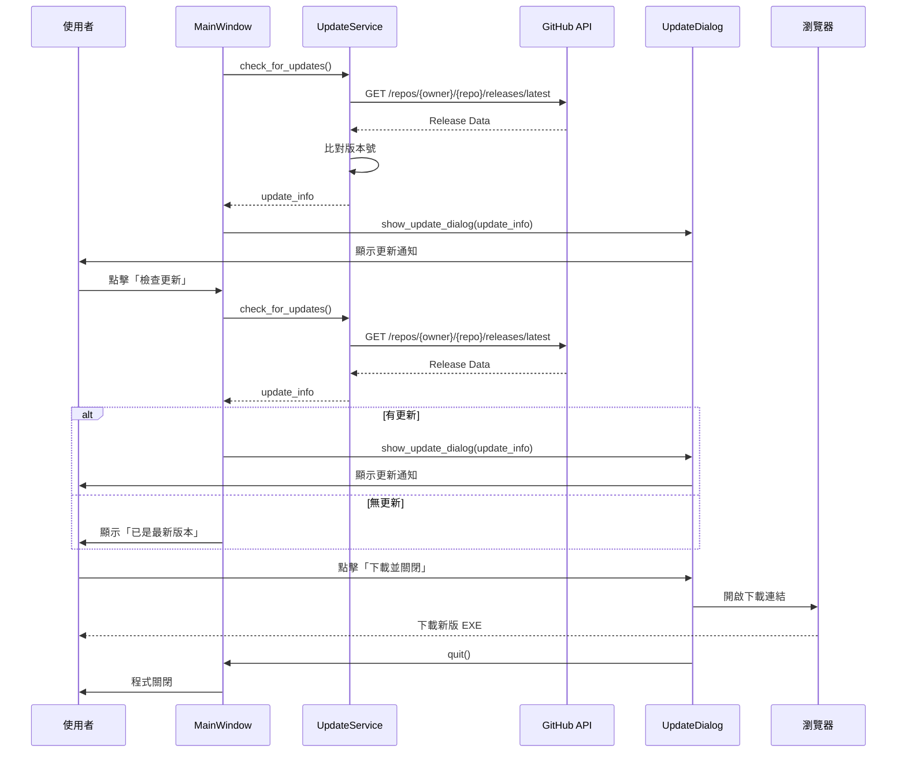

# 更新機制設計文件

> **版本**: v1.2.0+  
> **設計原則**: SOLID、DRY、KISS、YAGNI  
> **安全性**: 遵循 OWASP 最佳實踐

---

## 📋 目錄

1. [概述](#概述)
2. [架構設計](#架構設計)
3. [使用者體驗流程](#使用者體驗流程)
4. [實作細節](#實作細節)
5. [未來改進方案](#未來改進方案)

---

## 概述

### 當前實作 (v1.2.0)

#### 特點
- ✅ **自動檢查**: 程式啟動時自動檢查 GitHub Releases
- ✅ **手動檢查**: 主視窗提供「檢查更新」按鈕
- ✅ **智慧對話框**: 顯示版本差異、更新內容、下載連結
- ✅ **快速更新**: 「下載並關閉」一鍵操作
- ✅ **無快取策略**: 確保每次都檢查最新版本

#### 限制
- ⚠️ **手動安裝**: 使用者需手動執行新版 EXE
- ⚠️ **單一 EXE**: 執行中的檔案無法自動替換

---

## 架構設計

### 元件職責 (SOLID - Single Responsibility)

```
UpdateService (src/services/update_service.py)
├── check_for_updates()          # 檢查 GitHub Releases API
├── _get_windows_exe_url()       # 解析下載連結
└── [已移除快取機制]             # 確保即時性

UpdateDialog (ui/components/update_dialog.py)
├── _create_widgets()            # 建立 UI 元件
├── _on_download_and_close()     # 下載並關閉程式
├── _on_download()               # 僅開啟下載頁面
└── _close_application()         # 關閉應用程式

MainWindow (ui/main_window.py)
├── _check_for_updates()         # 自動檢查 (啟動時)
├── on_check_update()            # 手動檢查 (按鈕觸發)
├── _check_update_task()         # 背景任務
└── _on_manual_update_check_complete()  # 完成回調
```

### 資料流程



---

## 使用者體驗流程

### 情境 1: 自動檢查更新 (啟動時)

```
1. 使用者啟動程式
   ↓
2. 登入成功後,背景檢查更新 (延遲 1 秒)
   ↓
3. 如果有新版本
   ├─→ 顯示更新對話框
   │   ├── 版本比較 (目前 → 最新)
   │   ├── 更新內容 (Release Notes)
   │   └── 三個按鈕:
   │       ├── ⬇️ 下載新版本並關閉 (推薦)
   │       ├── 📥 僅開啟下載頁面
   │       └── 稍後提醒
   └─→ 沒有更新則靜默跳過
```

### 情境 2: 手動檢查更新

```
1. 使用者點擊「🔄 檢查更新」按鈕
   ↓
2. 按鈕顯示「🔄 檢查中...」並禁用
   ↓
3. 背景查詢 GitHub API
   ↓
4. 檢查完成:
   ├─→ 有更新: 顯示更新對話框
   └─→ 無更新: 顯示「已是最新版本」訊息框
```

### 情境 3: 下載並安裝新版本

```
1. 使用者點擊「⬇️ 下載新版本並關閉」
   ↓
2. 開啟瀏覽器下載新版 EXE
   ↓
3. 延遲 1 秒後自動關閉程式
   ↓
4. 使用者下載完成後,執行新版 EXE
   ↓
5. 可選: 刪除舊版 EXE
```

---

## 實作細節

### 版本比較邏輯

**位置**: `src/core/version.py`

```python
def is_newer_version(current: str, latest: str) -> bool:
    """
    比較版本號 (語意化版本)
    
    例如:
    - is_newer_version("1.2.0", "1.3.0") → True
    - is_newer_version("1.2.0", "1.2.1") → True
    - is_newer_version("1.2.0", "1.2.0") → False
    """
```

### GitHub API 請求

**位置**: `src/services/update_service.py`

```python
# API Endpoint
GET https://api.github.com/repos/jony-zhou/overtime-assistant/releases/latest

# 回應範例
{
  "tag_name": "v1.3.0",
  "name": "v1.3.0 - 新功能發布",
  "body": "## 更新內容\n- 新功能 A\n- 修正 Bug B",
  "published_at": "2025-12-01T00:00:00Z",
  "html_url": "https://github.com/.../releases/tag/v1.3.0",
  "assets": [
    {
      "name": "overtime-assistant-1.3.0.exe",
      "browser_download_url": "https://.../download/v1.3.0/overtime-assistant-1.3.0.exe"
    }
  ]
}
```

### 更新對話框 UI

**位置**: `ui/components/update_dialog.py`

```
┌─────────────────────────────────────────┐
│  🎉 發現新版本                          │
├─────────────────────────────────────────┤
│  ┌─────────────────────────────────┐   │
│  │  目前版本: 1.2.0                │   │
│  │       ↓                          │   │
│  │  最新版本: 1.3.0                │   │
│  │  發布時間: 2025年12月01日       │   │
│  └─────────────────────────────────┘   │
│                                         │
│  更新內容:                              │
│  ┌─────────────────────────────────┐   │
│  │ ## 新功能                       │   │
│  │ - 功能 A                        │   │
│  │ - 功能 B                        │   │
│  │                                 │   │
│  │ ## 改進                         │   │
│  │ - 改進 C                        │   │
│  └─────────────────────────────────┘   │
│                                         │
│  💡 提示:下載後請關閉目前程式,          │
│         再執行新版本                    │
│                                         │
│  ┌───────────────────────────────────┐ │
│  │ ⬇️  下載新版本並關閉             │ │ ← 推薦
│  └───────────────────────────────────┘ │
│  ┌───────────────────────────────────┐ │
│  │ 📥 僅開啟下載頁面                │ │
│  └───────────────────────────────────┘ │
│  ┌───────────────────────────────────┐ │
│  │ 稍後提醒                         │ │
│  └───────────────────────────────────┘ │
└─────────────────────────────────────────┘
```

### 安全性考量 (OWASP)

#### 1. HTTPS Only
```python
# 僅使用 HTTPS API
self.api_url = f"https://api.github.com/repos/{repo_owner}/{repo_name}/releases/latest"
```

#### 2. 驗證下載來源
```python
# 僅接受來自 github.com 的下載連結
if "github.com" in download_url:
    webbrowser.open(download_url)
```

#### 3. 無敏感資料傳輸
- 不傳送任何使用者資料到 GitHub
- API 請求為唯讀操作

#### 4. 錯誤處理
```python
try:
    response = requests.get(self.api_url, timeout=5)
    response.raise_for_status()
except requests.exceptions.Timeout:
    logger.warning("更新檢查超時")
    return None
except requests.exceptions.ConnectionError:
    logger.warning("無法連線到 GitHub")
    return None
```

---

## 未來改進方案

### 階段二: 自動下載 (進階) 🚀

#### 方案 A: 背景下載 + 通知安裝

**優點**:
- ✅ 使用者體驗佳,無需手動下載
- ✅ 下載完成後提示安裝

**實作**:
```python
class UpdateService:
    def download_update(self, url: str, callback: callable) -> None:
        """背景下載更新檔案"""
        def download_task():
            response = requests.get(url, stream=True)
            total_size = int(response.headers.get('content-length', 0))
            
            with open('overtime-assistant-new.exe', 'wb') as f:
                for chunk in response.iter_content(chunk_size=8192):
                    f.write(chunk)
                    # 回報進度
                    callback(progress=...)
        
        thread = threading.Thread(target=download_task, daemon=True)
        thread.start()
```

**挑戰**:
- ⚠️ 需處理下載失敗、中斷、檔案損壞
- ⚠️ 需要進度條 UI
- ⚠️ 需要驗證下載檔案完整性 (SHA256)

---

### 階段三: 自動安裝 (專業級) 🎯

#### 方案 B: 自解壓縮 + 啟動器

**架構**:
```
overtime-assistant-1.2.0.exe (當前版本)
    ↓ 下載
overtime-assistant-1.3.0.exe (新版本)
    ↓ 啟動
updater.exe (更新啟動器,內嵌於 EXE)
    ↓ 執行
1. 關閉舊版 EXE
2. 重新命名/刪除舊版
3. 啟動新版 EXE
```

**實作技術**:
- PyInstaller 打包時內嵌 `updater.exe`
- 使用 Windows API 監控父程序
- 批次檔案輔助刪除舊版

**參考專案**:
- [pyupdater](https://github.com/Digital-Sapphire/PyUpdater)
- [auto-py-to-exe](https://github.com/brentvollebregt/auto-py-to-exe)

**挑戰**:
- ⚠️ 需要處理 Windows UAC 權限
- ⚠️ 檔案鎖定問題
- ⚠️ 殺毒軟體誤報
- ⚠️ 開發成本高

---

### 階段四: Delta 更新 (企業級) 🏢

#### 方案 C: 差分更新

**原理**:
- 僅下載變更的部分 (Binary Diff)
- 減少下載大小和時間

**技術**:
- [bsdiff](https://github.com/mendsley/bsdiff) - Binary diff/patch
- [courgette](https://www.chromium.org/developers/design-documents/software-updates-courgette/) - Chrome 使用的差分演算法

**適用場景**:
- 應用程式超過 100MB
- 頻繁發布小更新
- 使用者網路環境較差

**不建議原因**:
- 🚫 本專案 EXE 約 50-100MB,全量下載可接受
- 🚫 更新頻率不高 (約 1-2 週/次)
- 🚫 實作複雜度遠超收益 (違反 YAGNI 原則)

---

## 建議採用方案

### 當前版本 (v1.2.0): ✅ 已實作

**特點**: 手動下載 + 智慧對話框

**評估**:
- ✅ 簡單可靠,符合 KISS 原則
- ✅ 無需擔心自動更新失敗
- ✅ 使用者完全掌控更新時機
- ✅ 開發成本低,維護容易

**適用**:
- 個人專案
- 中小型團隊工具
- 更新頻率低 (1-2 週/次)

---

### 未來版本 (v1.3.0+): 🎯 可選實作

**方案**: 背景下載 + 通知安裝 (階段二)

**理由**:
1. **漸進式改進**: 不破壞現有功能
2. **使用者體驗提升**: 自動下載,但仍需手動安裝
3. **風險可控**: 下載失敗不影響程式運行
4. **開發成本合理**: 約 2-3 天開發時間

**實作優先級**: 🟡 中等

---

## 測試策略

### 單元測試

**檔案**: `tests/test_update_service.py`

```python
def test_check_for_updates_success():
    """測試成功檢查更新"""
    
def test_check_for_updates_no_update():
    """測試無更新時的行為"""
    
def test_check_for_updates_timeout():
    """測試請求超時"""
    
def test_get_windows_exe_url_found():
    """測試找到 Windows EXE 下載連結"""
```

### 整合測試

1. **模擬 GitHub API 回應**: 使用 `responses` 套件
2. **測試對話框顯示**: 使用 `pytest-qt` (如果需要)
3. **測試按鈕行為**: Mock `webbrowser.open`

### 手動測試檢查清單

- [ ] 啟動程式時自動檢查更新
- [ ] 點擊「檢查更新」按鈕
- [ ] 發現新版本時顯示對話框
- [ ] 無更新時顯示訊息框
- [ ] 點擊「下載並關閉」開啟瀏覽器並關閉程式
- [ ] 點擊「僅開啟下載頁面」不關閉程式
- [ ] 點擊「稍後提醒」關閉對話框
- [ ] 網路中斷時不顯示錯誤,靜默失敗

---

## 程式碼品質檢查

### SOLID 原則檢查

- ✅ **單一職責 (SRP)**: 
  - `UpdateService` 只負責版本檢查
  - `UpdateDialog` 只負責 UI 顯示
  - `MainWindow` 協調更新流程

- ✅ **開放封閉 (OCP)**:
  - 可擴充新的更新來源 (繼承 `UpdateService`)
  - 可替換對話框實作

- ✅ **依賴反轉 (DIP)**:
  - `MainWindow` 依賴抽象的 `UpdateService`
  - 使用依賴注入模式

### DRY 原則檢查

- ✅ 背景任務執行統一使用 `_execute_in_background`
- ✅ 錯誤處理統一在 `UpdateService` 內
- ✅ 對話框樣式使用設計系統 (`ui/config/design_system.py`)

### KISS 原則檢查

- ✅ 更新流程簡單直觀
- ✅ 無複雜的快取機制
- ✅ 錯誤時靜默失敗,不干擾使用者

### YAGNI 原則檢查

- ✅ 不實作自動安裝 (當前不需要)
- ✅ 不實作差分更新 (過度設計)
- ✅ 不實作更新回滾 (複雜度過高)

---

## 參考資料

### 文件
- [PyInstaller 文件](https://pyinstaller.org/)
- [GitHub Releases API](https://docs.github.com/en/rest/releases/releases)
- [語意化版本 (Semantic Versioning)](https://semver.org/)

### 類似專案
- [auto-py-to-exe](https://github.com/brentvollebregt/auto-py-to-exe)
- [PyUpdater](https://github.com/Digital-Sapphire/PyUpdater)
- [Electron Auto Updater](https://www.electronjs.org/docs/latest/api/auto-updater)

---

**最後更新**: 2025-12-01  
**維護者**: 開發團隊  
**狀態**: ✅ 已實作並測試
