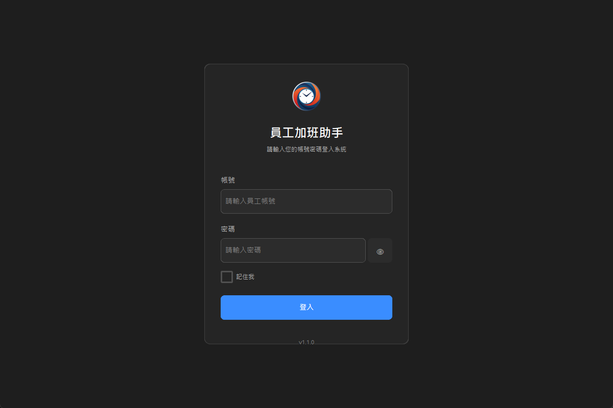
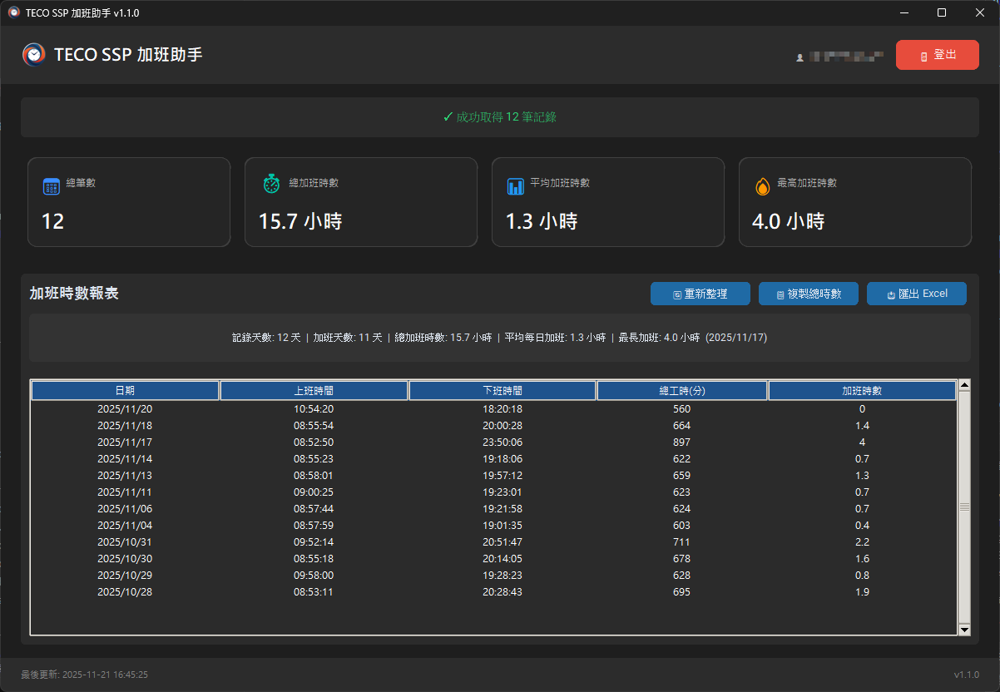

# GitHub Release v1.1.0

## Release Title
```
v1.1.0 - UI/UX 改版 + 安全記住我功能
```

## Release Notes

### 🎨 重大更新：全面 UI/UX 重新設計

此版本對整個應用程式進行 UI/UX 改造,遵循現代設計原則和軟體工程最佳實踐,並新增安全的「記住我」功能。

---

## ✨ 新功能

### 1. 全新設計系統 🎨

建立完整的設計系統,確保整個應用程式視覺一致性:

#### 顏色系統
- **深色主題**: 專業的深色背景 (#1a1a1a)
- **主色調**: 亮藍色 (#3b82f6) + Hover 效果
- **語義化顏色**: Success/Warning/Error 狀態色

#### 字體系統
- **主字體**: 微軟正黑體 UI
- **大小規範**: H1~H3 標題 + Body + Caption
- **字重**: Normal/Bold (Tkinter 原生支援)

#### 間距系統
- **8px 基準網格**: xs(4) → sm(8) → md(12) → lg(16) → xl(24) → 2xl(32)
- **元件尺寸**: 統一的按鈕/輸入框高度 (sm/md/lg)

#### 邊框與陰影
- **圓角**: sm(4) → md(8) → lg(12) → xl(16)
- **預定義樣式**: CARD / PRIMARY_BUTTON / INPUT

### 2. 登入頁面全面重新設計 🔐

#### 視覺改進
- ✅ **750x550 卡片式設計** (原 420px → 750px 加寬)
- ✅ **應用程式圖示**: 使用 `assets/icon.png` (64x64)
- ✅ **清晰的視覺層次**: Logo → 標題 → 表單
- ✅ **版本號顯示**: 底部顯示當前版本

#### 功能增強
- ✅ **密碼顯示/隱藏**: 點擊 👁/🙈 切換密碼可見性
- ✅ **記住我核取框**: 勾選後自動儲存憑證
- ✅ **鍵盤快捷鍵**: Enter 鍵快速登入
- ✅ **載入狀態**: 登入中禁用所有輸入

### 3. 主視窗全面重構 🏗️

#### 頂部導覽列
- ✅ **Logo**: 使用 `assets/icon.png` (32x32)
- ✅ **應用程式標題**: TECO SSP 加班助手
- ✅ **使用者資訊**: 顯示當前登入帳號
- ✅ **登出按鈕**: 快速登出功能

#### 統計卡片區 (4 張資料卡)
- 📅 **總筆數**: 顯示加班紀錄總數
- ⏱️ **總加班時數**: 累計加班時間
- 📊 **平均加班時數**: 平均值計算
- 🔥 **最高加班時數**: 單日最高紀錄

#### 底部資訊列
- 🕐 **最後更新時間**: 顯示資料更新時間
- 📌 **版本號**: 顯示當前應用程式版本

### 4. 安全的「記住我」功能 🔒

#### 安全性設計 (OWASP 最佳實踐)
- ✅ **Windows Credential Manager**: 使用系統級憑證儲存
- ✅ **Fernet 對稱加密**: 密碼經 AES-128 加密後儲存
- ✅ **唯一服務名稱**: `TECO_SSP_OvertimeAssistant`
- ✅ **記憶體清除**: 登出時清除敏感資料
- ✅ **日誌保護**: 不在日誌中記錄密碼

#### 使用體驗
- ✅ **自動填入**: 下次啟動自動填入帳號密碼
- ✅ **不自動登入**: 需手動點擊登入按鈕 (安全考量)
- ✅ **持久化儲存**: 登出不清除憑證
- ✅ **清除憑證**: 取消勾選「記住我」並重新登入即可清除

---

## 🔧 技術改進

### 軟體工程原則

#### SOLID 原則
- ✅ **Single Responsibility**: `MainWindow` 拆分為多個單一職責方法
- ✅ **Open/Closed**: 透過 `StatisticsCard` 元件擴展統計功能
- ✅ **Liskov Substitution**: 所有 Frame 繼承自 `ctk.CTkFrame`
- ✅ **Interface Segregation**: 精簡的 callback 介面
- ✅ **Dependency Inversion**: 依賴 `AuthService`/`DataService` 抽象

#### DRY (Don't Repeat Yourself)
- ✅ **設計系統**: 所有顏色/字體/間距統一管理
- ✅ **統計卡片**: 資料驅動,避免重複程式碼
- ✅ **背景任務**: 統一的 `_run_in_background()` 方法

#### KISS (Keep It Simple, Stupid)
- ✅ **清晰命名**: `_create_navbar()` / `_create_statistics_section()`
- ✅ **簡潔結構**: 每個方法專注單一任務
- ✅ **易讀程式碼**: 避免複雜的巢狀邏輯

#### YAGNI (You Aren't Gonna Need It)
- ✅ **只實現必要功能**: 不過度設計
- ✅ **漸進式開發**: 根據需求逐步新增

### 程式碼品質

#### 模組化
- 新增 `ui/config/design_system.py` - 設計系統
- 新增 `ui/components/statistics_card.py` - 可重用元件
- 新增 `src/services/credential_manager.py` - 憑證管理

#### 重構
- `ui/main_window.py` - 完整重構 (~500 行)
- `ui/components/login_frame.py` - 全新設計 (~290 行)

#### 新增工具
- `clear_credentials.py` - 清除儲存憑證的工具腳本

---

## 🐛 Bug 修復

### 屬性名稱修正
- ✅ 修正 `OvertimeReport.total_hours` → `total_overtime_hours`
- ✅ 修正 `OvertimeReport.max_hours` → `max_overtime_hours`

### UI 問題修正
- ✅ 修正登入卡片寬度無法調整問題 (grid → place 布局)
- ✅ 修正密碼顯示圖示重疊問題 (👁‍🗨 → 🙈)
- ✅ 修正 Logo 圖示使用 emoji 而非 PNG 問題

---

## 📦 相依套件更新

### 新增套件
```
keyring>=25.0.0          # 系統憑證管理
cryptography>=46.0.0     # 密碼加密
```

### 現有套件
```
customtkinter==5.2.2
requests>=2.31.0
openpyxl>=3.1.0
python-dotenv>=1.0.0
beautifulsoup4>=4.12.0
lxml>=4.9.0
```

---

## 📊 專案統計

### 程式碼量
- **新增代碼**: ~1000 行
- **重構代碼**: ~500 行
- **總代碼量**: ~5000 行

### 測試
- **單元測試**: 44 個測試全部通過 ✅
- **測試覆蓋率**: 維持高覆蓋率

### 檔案變更
- **新增**: 3 個檔案
- **修改**: 5 個核心檔案
- **刪除**: 0 個檔案

---

## 🚀 安裝與使用

### 下載
從本頁面的 **Assets** 區下載 `overtime-assistant-1.1.0.exe`

### 系統需求
- **作業系統**: Windows 10/11 (64-bit)
- **記憶體**: 建議 4GB 以上
- **硬碟空間**: 約 100MB

### 使用方式
1. 下載 `overtime-assistant-1.1.0.exe`
2. 雙擊執行 (無需安裝)
3. 首次登入時勾選「記住我」
4. 下次啟動會自動填入帳號密碼

---

## 🔄 升級指南

### 從 v1.0.x 升級

#### 升級步驟
1. ✅ 下載 `overtime-assistant-1.1.0.exe`
2. ✅ 直接執行新版本 (無需解除安裝舊版)
3. ✅ 首次登入後勾選「記住我」啟用新功能

#### 資料相容性
- ✅ **完全向下相容**: 無需遷移資料
- ✅ **設定檔相容**: 使用相同的 `config.py`
- ✅ **報表相容**: Excel 匯出格式不變

#### 注意事項
- Windows Credential Manager 首次訪問時會要求授權
- 密碼經加密儲存,無法直接查看明文
- 若要停止記住密碼,取消勾選「記住我」並重新登入

---

## 🎯 設計亮點

### 視覺設計
- ✅ **專業深色主題**: 降低眼睛疲勞
- ✅ **清晰的視覺層次**: 重要資訊突出顯示
- ✅ **統一的設計語言**: 整體風格一致

### 互動設計
- ✅ **即時回饋**: 按鈕 Hover / 載入狀態
- ✅ **鍵盤支援**: Enter 快速登入
- ✅ **視覺提示**: 密碼可見性切換

### 資訊架構
- ✅ **導覽列**: 快速訪問常用功能
- ✅ **統計儀表板**: 關鍵數據一目瞭然
- ✅ **底部資訊**: 更新時間和版本號

---

## 🔒 安全性說明

### 憑證儲存
- **儲存位置**: Windows Credential Manager (系統級)
- **加密方式**: Fernet (AES-128-CBC + HMAC)
- **服務名稱**: `TECO_SSP_OvertimeAssistant`

### 最佳實踐
- ✅ 密碼不以明文儲存
- ✅ 日誌不記錄敏感資訊
- ✅ 登出時清除記憶體
- ✅ 錯誤訊息不洩漏系統資訊

### 清除憑證
若需清除儲存的憑證,有兩種方式:

#### 方式 1: 應用程式內清除
1. 登入時取消勾選「記住我」
2. 點擊登入
3. 憑證已清除

#### 方式 2: 手動清除
```powershell
# 執行專案內的清除腳本
python clear_credentials.py
```

#### 方式 3: Windows Credential Manager
1. 開啟「控制台」→「使用者帳戶」→「認證管理員」
2. 找到 `TECO_SSP_OvertimeAssistant`
3. 點擊「移除」

---

## 📝 版本比較

| 版本 | UI 設計 | 記住我 | 統計卡片 | 說明 |
|------|---------|--------|----------|------|
| v1.0.0 | 基礎 UI | ❌ | ❌ | 首個正式版 |
| v1.0.1 | 基礎 UI | ❌ | ❌ | 修正檔名 |
| v1.0.2 | 基礎 UI | ❌ | ❌ | 修復版本檢查 |
| v1.1.0 | ✅ 專業設計 | ✅ 安全加密 | ✅ 資料儀表板 | **UI/UX 大改版** ⭐ |

---

## 📸 功能截圖

### 登入頁面



**特色**:
- ✅ 400x550 大卡片設計
- ✅ 應用程式圖示 (64x64)
- ✅ 密碼顯示/隱藏切換 (👁/🙈)
- ✅ 記住我核取框
- ✅ 版本號顯示

### 主視窗儀表板



**特色**:
- ✅ 頂部導覽列 (Logo + 標題 + 使用者 + 登出)
- ✅ 4 張統計卡片 (總筆數 / 總時數 / 平均 / 最高)
- ✅ 詳細報表表格
- ✅ 底部資訊列 (更新時間 + 版本號)

---

## 💬 支援

- 🐛 **回報問題**: [GitHub Issues](https://github.com/jony-zhou/-----2.0/issues)
- 💡 **功能建議**: [GitHub Discussions](https://github.com/jony-zhou/-----2.0/discussions)
- 📖 **完整文件**: [README](https://github.com/jony-zhou/-----2.0/blob/main/readme.md)

---

## 🙏 致謝

感謝所有測試人員和使用者的寶貴回饋!

特別感謝:
- **UI/UX 改進建議**: 登入卡片寬度、版本號顯示、圖示使用
- **安全性建議**: 憑證儲存方式、密碼加密
- **功能建議**: 記住我功能、統計儀表板

---

## 📅 發布資訊

- **版本號**: v1.1.0
- **發布日期**: 2025-01-21
- **變更類型**: Minor Version (次版本)
- **相容性**: Windows 10/11 (64-bit)
- **檔案大小**: 約 50-100 MB
- **重要性**: **強烈建議升級** ⭐⭐⭐

---

**🎉 重大更新！專業 UI/UX 設計 + 安全記住我功能，全面提升使用體驗！** ✨🔒

---

### 下一步計畫

我們正在規劃 v1.2.0 的功能:
- 📊 更多統計圖表
- 🎨 主題切換 (淺色/深色)
- 🌐 多語言支援
- 📱 響應式佈局

敬請期待! 🚀
