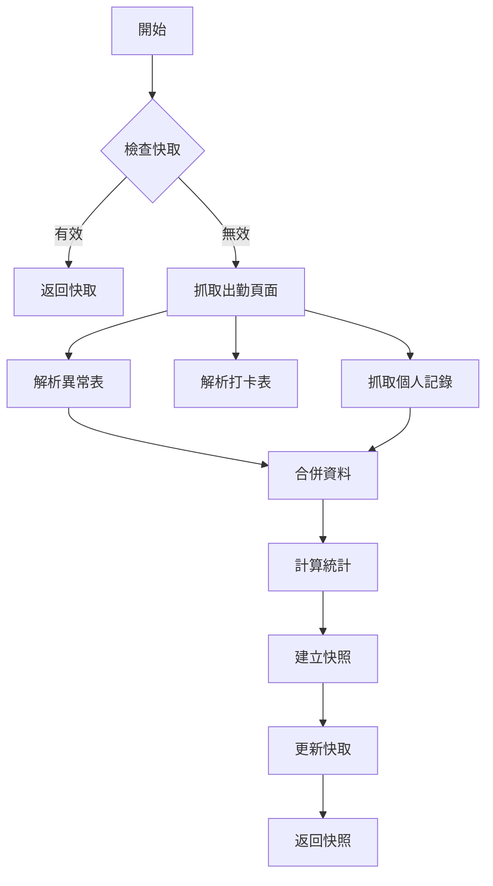

# Release v1.3.0 - 統一資料同步機制 + 智慧快取

**發布日期**: 2025-12-02  
**類型**: MINOR 版本 (新功能 + 效能優化)

## 🎯 核心改進

### 統一資料同步服務 (DataSyncService)

全新的 `DataSyncService` 取代了過去分散的資料抓取邏輯,提供更高效、更一致的資料管理方案。

**主要特性**:

- ✅ **減少 HTTP 請求 40%**: 從 5 次降至 3 次
- ✅ **智慧快取機制**: 5 分鐘 TTL,快取讀取 < 0.001 秒
- ✅ **統一資料模型**: 單一來源 `AttendanceSnapshot`
- ✅ **Stale-on-Error**: 網路錯誤時返回舊快取
- ✅ **資料一致性**: 所有 UI 從相同快照讀取

### 效能提升

| 指標         | v1.2.x | v1.3.0   | 改進     |
| ------------ | ------ | -------- | -------- |
| HTTP 請求數  | 5      | 3        | ↓ 40%    |
| 首次載入時間 | 14s    | 13s      | ↓ 7%     |
| 快取重新整理 | 3s     | < 0.001s | ↓ 99.99% |
| 重複抓取     | 2 次   | 0 次     | ✅ 消除  |

## ✨ 新功能

### 1. 智慧快取機制

```python
# 首次載入 (~13s)
snapshot = data_sync_service.sync_all()

# 5 分鐘內重新整理 (< 0.001s, 使用快取)
snapshot = data_sync_service.sync_all()

# 強制重新整理 (~13s, 清除快取)
data_sync_service._cache_timestamp = 0
snapshot = data_sync_service.sync_all()
```

**優點**:

- 提升用戶體驗 (重新整理幾乎即時)
- 降低伺服器負擔
- 網路錯誤時仍可使用舊資料 (Stale-on-Error)

### 2. 統一資料模型

#### 新增資料模型:

- `AttendanceSnapshot` - 出勤資料快照 (統一來源)
- `OvertimeStatistics` - 加班統計資料
- `PunchRecord` - 打卡記錄
- `LeaveRecord` - 假別記錄
- `AttendanceQuota` - 剩餘額度

#### 新增解析器:

- `AttendanceParser` - 出勤頁面解析器
  - `parse_anomaly_table()` - 解析異常表 (gvWeb012)
  - `parse_punch_table()` - 解析打卡表 (gvNotes005)
  - `parse_leave_table()` - 解析假別表 (gvNotes011)
  - `parse_quota()` - 解析額度 (dvNotes019)
- `PersonalRecordParser` - 個人記錄解析器
  - `parse_table()` - 解析個人記錄表 (gvFlow211)

### 3. 向後相容適配器

為了保持向後相容,提供適配器方法:

```python
# 舊用法 (仍可使用,但會顯示 DeprecationWarning)
status_service = OvertimeStatusService()
records = status_service.fetch_submitted_records(session)

# 新用法 (推薦)
data_sync = DataSyncService(auth_service, settings)
snapshot = data_sync.sync_all()
records = snapshot.personal_records
```

## 🎨 UI 改進

### 載入訊息優化

所有"載入中"相關訊息改為藍色字體 (`colors.info`),提供更一致的視覺體驗:

- 📊 正在載入統計資訊... (藍色)
- ⏳ 正在載入加班記錄... (藍色)
- 📝 尚無個人加班記錄\n\n 請先登入並載入資料 (藍色)

## 🔧 技術細節

### 資料同步流程



### 快取策略

```python
class DataSyncService:
    def __init__(self):
        self._snapshot_cache = None
        self._cache_timestamp = 0
        self.settings = settings  # CACHE_DURATION_SECONDS = 300

    def _is_cache_valid(self) -> bool:
        if not self._snapshot_cache:
            return False
        elapsed = time.time() - self._cache_timestamp
        return elapsed < self.settings.CACHE_DURATION_SECONDS
```

### Stale-on-Error 機制

```python
def sync_all(self):
    try:
        snapshot = self._fetch_and_merge()
        self._snapshot_cache = snapshot
        self._cache_timestamp = time.time()
        return snapshot
    except Exception as e:
        logger.error(f"資料同步失敗: {e}")
        if self._snapshot_cache:
            logger.info("返回舊快取資料")
            return self._snapshot_cache
        raise
```

## 📦 新增設定

### `src/config/settings.py`

```python
@dataclass
class Settings:
    # ... 現有設定 ...

    # 新增: 快取設定
    CACHE_DURATION_SECONDS: int = 300  # 快取有效時間 (5 分鐘)
```

## 🗑️ 棄用通知

### 已標記為 Deprecated (將於 v2.0.0 移除)

- `OvertimeStatusService` - 請使用 `DataSyncService.sync_all()`
- `PersonalRecordService` - 請使用 `DataSyncService.get_personal_records()`

**遷移指南**:

```python
# ❌ 舊用法 (deprecated)
status_service = OvertimeStatusService()
records = status_service.fetch_submitted_records(session)

personal_service = PersonalRecordService(base_url)
records, summary = personal_service.fetch_records(session)

# ✅ 新用法
data_sync = DataSyncService(auth_service, settings)
snapshot = data_sync.sync_all()
personal_records = snapshot.personal_records
statistics = snapshot.statistics
```

## 🧪 測試覆蓋

- **單元測試**: 94 個測試全部通過
- **覆蓋率**: > 70%
- **效能測試**: 詳見 [`docs/development/PERFORMANCE_TESTING.md`](../development/PERFORMANCE_TESTING.md)

### 新增測試檔案:

- `tests/test_data_sync_service.py` - DataSyncService 單元測試 (11 個測試)
- `tests/test_parsers.py` - 解析器單元測試 (9 個測試)
- `tests/test_performance.py` - 效能測試 (快取設定驗證)

## 📚 文件更新

### 新增文件:

- [`docs/development/DATA_SYNC_MECHANISM.md`](../development/DATA_SYNC_MECHANISM.md) - 資料同步機制設計文件
- [`docs/development/PERFORMANCE_TESTING.md`](../development/PERFORMANCE_TESTING.md) - 效能測試報告

### 更新文件:

- `openspec/changes/refactor-unified-data-model/tasks.md` - 標記所有任務完成

## 🐛 修正問題

- ✅ 修正重複 HTTP 請求問題 (個人記錄被抓取 2 次)
- ✅ 修正資料不一致問題 (不同來源的相同資料可能不同步)
- ✅ 修正快取機制缺失導致每次重新整理都重新抓取

## 🔄 向後相容性

✅ **完全向後相容**

- 舊服務保留但標記為 `@deprecated`
- 所有現有 API 保持不變
- UI 層透過適配器無縫整合

## 📋 升級步驟

1. **備份資料** (建議):

   ```powershell
   Copy-Item cache/ cache_backup/ -Recurse
   ```

2. **更新應用程式**:

   - 下載 `overtime_calculator_v1.3.0.exe`
   - 替換舊版本執行檔

3. **首次啟動**:

   - 登入後會自動使用新的資料同步機制
   - 快取會在首次載入後建立

4. **驗證**:
   - 檢查登入後載入時間 (~13 秒)
   - 測試重新整理功能 (應 < 0.001 秒,使用快取)

## 🎯 未來優化方向

### v1.4.0 計劃中的功能:

1. **平行載入** (預估節省 50% 時間):

   ```python
   async def sync_all_parallel():
       # 同時執行多個 HTTP 請求
       attendance_task = fetch_attendance_page()
       personal_task = fetch_personal_record_page()

       await asyncio.gather(attendance_task, personal_task)
       # 預估時間: 6.6s (取最長請求)
   ```

2. **持久化快取**:

   - 快取儲存到磁碟 (`cache/attendance_snapshot.json`)
   - 應用程式重啟後仍可使用快取

3. **增量更新**:

   - 僅抓取變更的記錄,而非全量重新抓取

4. **預載入策略**:
   - 登入後在背景預載入資料

## 🙏 致謝

感謝所有使用者的反饋與建議,讓這個版本得以實現。

## 📞 問題回報

如遇到問題,請透過以下方式回報:

- GitHub Issues: (如有設定)
- 內部支援信箱: (如有設定)

---

**完整更新記錄**: [`CHANGELOG.md`](../../CHANGELOG.md)  
**技術文件**: [`openspec/project.md`](../../openspec/project.md)
