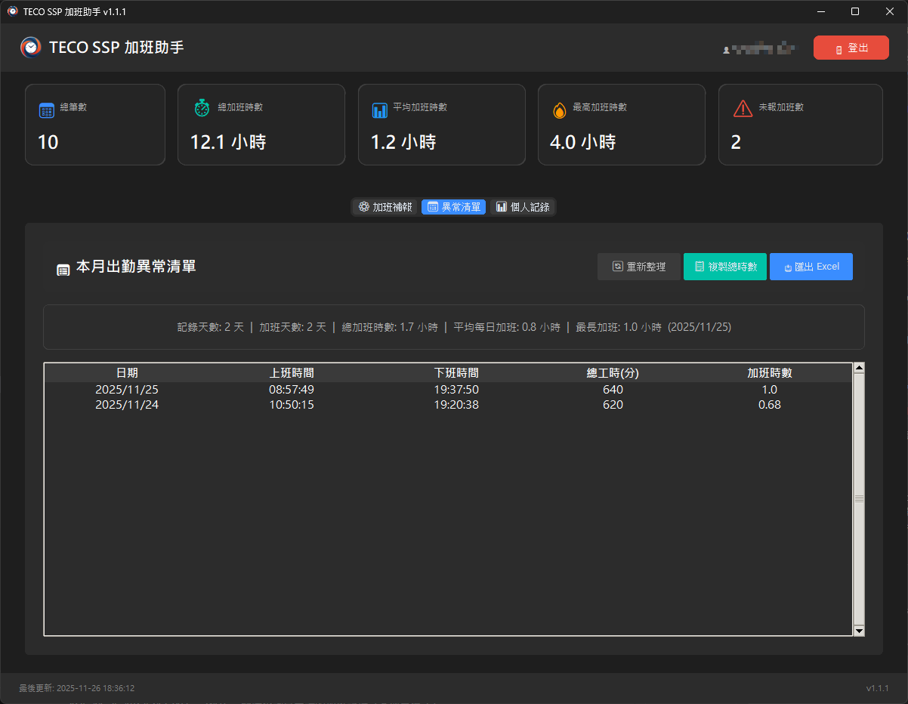
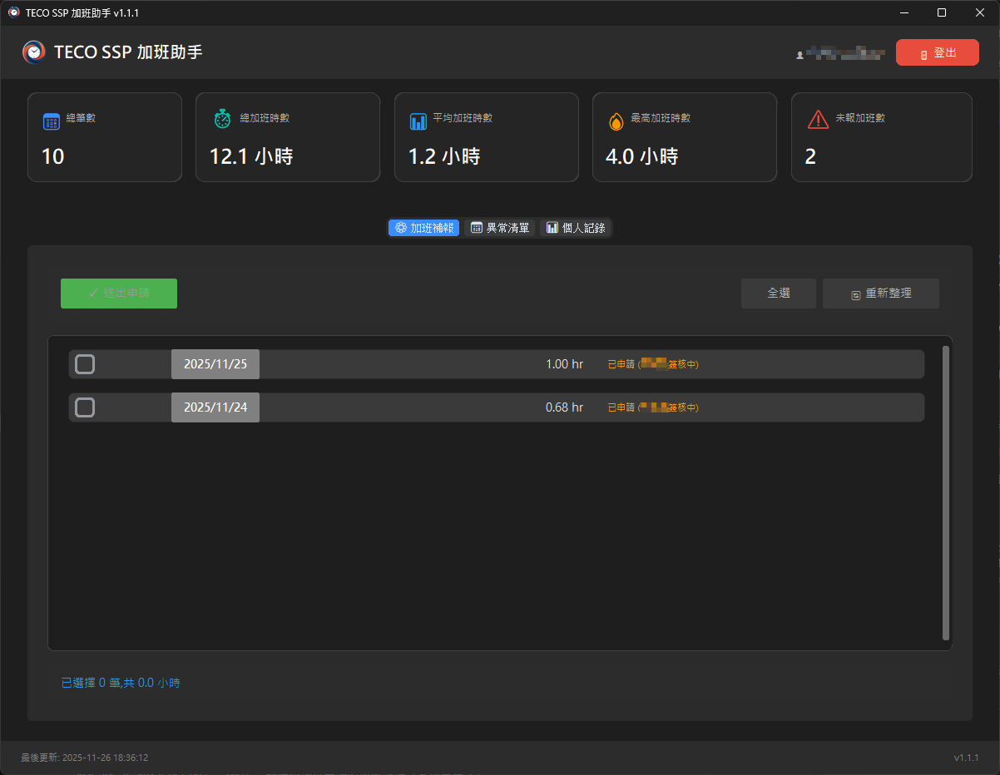

# TECO SSP 加班時數計算器

## 功能說明

現代化的圖形介面應用程式,自動登入 TECO SSP 系統,提供以下功能:

1. **📅 出勤異常清單**: 抓取出勤資料,自動計算每日加班時數
2. **⚙️ 加班補報自動填寫**: 一鍵填寫加班補報申請單,大幅節省時間
3. **📊 統計儀表板**: 即時顯示加班統計資訊
4. **💾 Excel 匯出**: 匯出詳細報表供後續使用

### 📸 應用程式截圖

#### 📅 本月出勤異常


#### ⚙️ 加班時數補報


#### 📊 個人紀錄


### GUI 版本特色 (v1.2.0)

- 🎨 **專業 UI/UX 設計**: 全新設計系統,統一視覺風格
- ⚙️ **加班補報自動填寫**: 智慧填寫加班申請表單,降低重複作業
- 📋 **已申請狀態查詢**: 自動查詢並標記已申請的記錄
- 🖱️ **一鍵預覽與送出**: 送出前預覽表單內容,避免錯誤
- 📊 **個人記錄查詢**: 第三個分頁顯示個人加班補報記錄,統計來自實際申請資料
- ⏰ **可編輯加班時數**: 支援直接編輯小時數,精確到小數點後兩位
- ✏️ **必填描述欄位**: 加班內容為必填項目,確保記錄完整性
- 🧩 **加班範本管理**: 內建「套用範本」選單與「管理範本」對話框,可自訂常用描述
- ⏱️ **小時單位計算**: 改用小時制,告別複雜的分鐘換算
- 🔐 **安全記住我功能**: Windows Credential Manager + Fernet 加密
- 📊 **統計儀表板**: 4 張資料卡片展示關鍵指標
- 🖥️ **三分頁介面**: 異常清單 + 加班補報 + 個人記錄,切換流暢
- 📋 **智慧複製**: 支援複製加班時數欄位 (逐行複製或全選)
- 💾 **Excel 匯出**: 一鍵匯出報表到 Excel 檔案
- 📝 **即時載入狀態**: 清楚顯示操作結果和 "⏳ 正在載入..." 狀態
- 🏗️ **SOLID 原則**: 遵循軟體工程最佳實踐
- ✅ **完整測試**: 67 單元測試,確保程式品質
- 📦 **獨立執行檔**: 支援打包成單一 EXE,無需安裝 Python
- 🔄 **自動更新檢查**: 啟動時自動檢查 GitHub 最新版本,有新版本時通知

## 加班時數計算公式

```
加班時數 = 下班時間 - 上班時間 - 70分鐘(午休) - 480分鐘(8小時正常上班) - 30分鐘(休息時間)
```

轉換為小時單位,例如: 90分鐘 = 1.5 小時

**注意**: 
- v1.2.0+ 版本改用**小時制**顯示和輸入
- 加班時數欄位可手動編輯,精確到小數點後兩位 (例如: 1.5, 2.75)
- 系統內部仍使用分鐘計算,送出時會自動轉換 (小時 × 60 = 分鐘)

## 快速開始

### 方法 1: 使用執行檔 (推薦)

直接執行打包好的程式:
```bash
dist\overtime-assistant-1.2.0.exe
```

**提示**: 檔名包含版本號,每次更新後版本號會自動變更

### 方法 2: 從原始碼執行

1. **安裝 Python 相依套件**
```bash
pip install -r requirements.txt
```

2. **執行應用程式**
```bash
python app.py
```

詳細說明請參考 [QUICKSTART.md](QUICKSTART.md)

## 使用流程

### 加班補報模式 (v1.2.0+)

1. **啟動程式**: 執行 `TECO加班計算器.exe` 或 `python app.py`
2. **登入系統**: 在登入介面輸入 SSP 帳號和密碼,點擊「登入」
3. **自動載入**: 程式自動抓取出勤資料並查詢已申請狀態
4. **檢視異常**: 預設顯示「📅 異常清單」分頁,查看出勤異常和加班時數
5. **切換補報**: 點擊「⚙️ 加班補報」分頁,檢視可補報的記錄
   - ✅ 綠色勾選: 將會送出
   - ⚠️ 灰色禁用: 已申請或審核中
   - ✏️ 可編輯欄位: 
     - **加班時數**: 直接輸入小時數 (精確到小數點後兩位,例如: 1.5)
     - **加班內容**: 必填欄位,描述加班原因
     - **加班/調休**: 選擇申請類型
   - 🧩 「套用範本」: 點擊下拉選單快速填入常用描述,按「✎ 管理範本」可新增/刪除範本
6. **查看記錄**: 點擊「📊 個人記錄」分頁,查看已申請的加班補報記錄
   - 顯示申請狀態 (通過/審核中/退回等)
   - 統計資料來自實際申請記錄
7. **預覽表單**: 在加班補報分頁點擊「預覽表單」檢查要送出的內容
8. **送出申請**: 確認無誤後點擊「送出申請」
9. **匯出 Excel**: 點擊「匯出 Excel」儲存報表
10. **登出**: 點擊右上角「登出」按鈕

**重要提示**: 
- 加班時數採用**小時制** (例如: 1.5 小時),系統會自動轉換為分鐘數送出
- 加班內容為**必填欄位**,必須填寫後才能送出
- 小時數可手動編輯,支援小數點後兩位 (0.01 小時 = 0.6 分鐘)

### 傳統模式 (僅查看異常清單)

1. **啟動程式**: 執行應用程式並登入
2. **切換分頁**: 點擊「📅 異常清單」
3. **檢視報表**: 在表格中查看出勤記錄和統計資訊
4. **複製資料**: 
   - 單選某行後按 `Ctrl+C` 或右鍵「複製加班時數」
   - 右鍵選擇「複製全部加班時數」
   - 點擊「複製總時數」按鈕複製統計數字
5. **匯出 Excel**: 點擊「匯出 Excel」將報表儲存到 `reports/` 資料夾
6. **登出**: 點擊右上角「登出」按鈕清除登入資訊

## 報表顯示

### GUI 表格檢視

程式會在視窗中以表格形式顯示:

#### 📅 異常清單分頁
- **日期**: 出勤日期 (可點擊排序)
- **上班時間**: 第一次刷卡時間
- **下班時間**: 最後一次刷卡時間
- **總工時**: 總工作分鐘數
- **加班時數**: 計算後的加班小時數 (可複製)

#### ⚙️ 加班補報分頁
- **勾選**: 選擇要送出的記錄 (已申請記錄顯示 ⚠️ 且禁用)
- **日期**: 加班日期
- **加班時數**: **可編輯欄位** (小時制,精確到 0.01 小時)
- **加班內容**: **必填欄位**,描述加班原因
- **加班/調休**: 下拉選單,選擇申請類型
- **範本工具**: 「套用範本」快速套用常用描述,「✎ 管理範本」可自訂清單
- **狀態**: 顯示申請狀態 (已申請/審核中/空白為未申請)

#### 📊 個人記錄分頁
- **日期**: 申請日期
- **內容**: 加班內容描述
- **狀態**: 申請狀態 (通過/審核中/退回等)
- **加班時數**: 申請的小時數
- **本月累計**: 當月累計加班時數
- **本季累計**: 當季累計加班時數
- **申報**: 申報類型 (加班/調休)

### 統計資訊

#### 全域統計卡片 (跨所有分頁)
- **總加班時數**: 累計加班總時數 (小時制,兩位小數)
- **平均每日加班**: 平均每天加班時數
- **最長加班**: 單日最長加班時數
- **總筆數**: 出勤記錄總筆數

#### 個人記錄統計 (📊 個人記錄分頁)
- **總記錄數**: 個人加班補報總筆數
- **總時數**: 已申請的總加班時數 (來自實際申請資料)
- **平均時數**: 平均每筆申請的加班時數
- **最高時數**: 單筆最高加班時數

### Excel 匯出格式

匯出的 Excel 檔案包含:
- 所有出勤記錄明細
- 自動格式化的欄位
- 統計數據彙總
- 檔案儲存於 `reports/overtime_report_YYYYMMDD_HHMMSS.xlsx`

## 程式架構

### MVC 分層設計

```
src/
├── core/              # 核心業務邏輯
│   ├── calculator.py  # OvertimeCalculator 加班計算類別
│   └── version.py     # 版本管理 (單一真實來源)
├── models/            # 資料模型
│   ├── attendance.py  # AttendanceRecord 出勤記錄
│   ├── report.py      # OvertimeReport 報表模型
│   ├── overtime_submission.py  # 加班補報資料模型
│   └── personal_record.py      # 個人記錄資料模型
├── services/          # 服務層
│   ├── auth_service.py         # AuthService 認證服務
│   ├── data_service.py         # DataService 資料擷取
│   ├── export_service.py       # ExportService Excel匯出
│   ├── overtime_status_service.py   # 已申請狀態查詢
│   ├── overtime_report_service.py   # 加班補報填寫服務
│   └── personal_record_service.py   # 個人記錄查詢服務
├── config/            # 配置設定
│   └── settings.py    # Settings 系統設定
└── utils/             # 工具函式
    └── logger.py      # 日誌設定

ui/
├── components/        # UI 元件
│   ├── login_frame.py        # 登入介面
│   ├── overtime_report_tab.py  # 加班補報分頁
│   ├── attendance_tab.py     # 異常清單分頁
│   ├── personal_record_tab.py  # 個人記錄分頁
│   ├── statistics_card.py    # 統計卡片
│   └── update_dialog.py      # 更新對話框
├── config/            # UI 配置
│   └── design_system.py      # 設計系統 (顏色/字體/間距)
└── main_window.py     # 主視窗 (三分頁介面)
```

### 核心類別說明

#### `OvertimeCalculator` (src/core/calculator.py)
- `calculate(records)`: 計算加班時數
- `_calculate_single(record)`: 單筆記錄計算
- `_parse_time(time_str)`: 時間解析

#### `AuthService` (src/services/auth_service.py)
- `login(username, password)`: 執行登入
- `_get_login_page()`: 取得 ViewState

#### `DataService` (src/services/data_service.py)
- `fetch_attendance_data(session)`: 抓取出勤資料
- `_fetch_page(session, page_num)`: 處理分頁

#### `PersonalRecordService` (src/services/personal_record_service.py)
- `fetch_personal_records(session)`: 抓取個人加班補報記錄
- `_parse_table_rows(html)`: 解析記錄表格

#### `MainWindow` (ui/main_window.py)
- `on_login()`: 登入處理 (背景執行)
- `fetch_data()`: 資料抓取 (背景執行)
- `fetch_personal_records()`: 個人記錄抓取 (背景執行,含 ⏳ 載入提示)
- `on_export()`: Excel 匯出
- `on_logout()`: 登出清除

### 資料流程

1. **使用者操作** → UI 元件
2. **UI 元件** → MainWindow 事件處理
3. **MainWindow** → Service 層 (背景執行緒)
4. **Service** → 核心業務邏輯
5. **結果** → UI 更新 (主執行緒)

## 注意事項

1. **網路連線**: 需要能夠訪問 `https://ssp.teco.com.tw`
2. **帳號權限**: 需要有效的 SSP 系統帳號
3. **SSL 憑證**: 程式已處理內部憑證問題 (`verify_ssl=False`)
4. **ASP.NET 網站**: 自動處理 ViewState 和 PostBack 機制
5. **時間格式**: 刷卡時間格式 `HH:MM:SS`,日期格式 `YYYY/MM/DD`
6. **分頁處理**: 自動抓取所有頁面 (最多 10 頁)
7. **背景執行**: 登入和資料抓取在背景執行,不會凍結介面
8. **資料夾**: 程式會自動建立 `reports/` 和 `logs/` 資料夾

## 客製化調整

### 修改版本號

**重要**: 版本號採用單一真實來源 (SSOT) 設計,只需修改一處!

編輯 `src/core/version.py`:

```python
VERSION = "1.2.0"  # 修改版本號
VERSION_NAME = "加班補報自動填寫 (正式版)"
```

重新封裝時會自動使用新版本號:
```bash
python -m PyInstaller overtime_calculator.spec --clean
# 產生: overtime-assistant-1.2.0.exe
```

詳細版本管理說明請參考 [docs/development/VERSION_MANAGEMENT.md](docs/development/VERSION_MANAGEMENT.md)

---

### 修改時間設定

編輯 `src/config/settings.py`:

```python
@dataclass
class Settings:
    LUNCH_BREAK: int = 70        # 午休時間 (分鐘)
    WORK_HOURS: int = 480        # 正常工時 (分鐘)
    REST_TIME: int = 30          # 休息時間 (分鐘)
    MAX_OVERTIME_HOURS: int = 4  # 單日最大加班時數
```

### 修改加班計算邏輯

編輯 `src/core/calculator.py` 的 `_calculate_single` 方法:

```python
# 目前公式
overtime_minutes = total_minutes - self.settings.LUNCH_BREAK - self.settings.WORK_HOURS - self.settings.REST_TIME

# 例如:不扣休息時間
overtime_minutes = total_minutes - self.settings.LUNCH_BREAK - self.settings.WORK_HOURS
```

### 修改 UI 主題

編輯 `ui/main_window.py`:

```python
ctk.set_appearance_mode("dark")  # 改為 "light" 或 "system"
ctk.set_default_color_theme("blue")  # 改為其他顏色主題
```

### 調整日誌等級

編輯 `src/utils/logger.py`:

```python
logger.setLevel(logging.DEBUG)  # DEBUG, INFO, WARNING, ERROR
```

## 疑難排解

### GUI 無法啟動
- 確認已安裝所有依賴: `pip install -r requirements.txt`
- 使用虛擬環境: `.venv\Scripts\python.exe app.py`
- 檢查 Python 版本 (建議 3.9+)

### 登入失敗
- 檢查帳號密碼是否正確
- 確認可連線到 `https://ssp.teco.com.tw`
- 查看狀態訊息欄的錯誤說明
- 檢查 `logs/overtime_calculator.log`

### 資料抓取失敗
- 確認帳號有權限訪問「出勤異常清單」
- 檢查網站是否維護中
- 查看日誌檔案了解詳細錯誤
- 可能是網頁結構變更,需更新解析邏輯

### 複製功能無效
- 確認已選取表格中的項目
- 使用 `Ctrl+C` 或右鍵選單
- 只能複製加班時數欄位

### Excel 匯出失敗
- 檢查 `reports/` 資料夾是否存在 (程式會自動建立)
- 確認檔案未被其他程式開啟
- 檢查磁碟空間是否充足

### 打包執行檔問題
- 使用虛擬環境打包: `.venv\Scripts\python.exe -m PyInstaller overtime_calculator.spec --clean`
- 確認 `assets/icon.ico` 存在
- Windows Defender 可能誤判,加入信任清單
- 參考 [BUILD.md](BUILD.md) 詳細說明

### 圖示不顯示
- 確認 `assets/icon.ico` 和 `assets/icon.png` 存在
- 重新打包: `pyinstaller overtime_calculator.spec --clean --noconfirm`
- 開發環境會優先使用 `.ico`,打包版本也會包含圖示檔案

## 授權與免責聲明

本程式僅供個人使用,請勿用於非法用途。使用本程式所產生的任何後果由使用者自行承擔。

## 更新記錄

### v1.2.0 (2025/11/28): 範本管理與正式釋出 ✅

**新功能**:
- 🧩 **加班範本管理**: 內建「套用範本」下拉選單與「✎ 管理範本」對話框,支援自訂儲存常用描述
- 💾 **範本永久儲存**: 範本設定寫入 `cache/overtime_templates.json`,重啟後仍保留
- ⚙️ **補報正式啟用**: 預設開啟送出功能,可直接提交加班申請單

**體驗優化**:
- 📸 更新應用程式截圖至最新介面
- 📝 調整文件與 Quickstart 說明,新增範本操作流程
- 🔧 新增 `TemplateManager` 服務並整合至 UI,維持程式架構模組化

**測試**:
- ✅ 新增 `test_template_manager.py` 覆蓋範本儲存與載入案例
- ✅ 擴充 `test_overtime_report_tab.py`,驗證範本選單同步與套用流程

---

### v1.2.0-beta (2025/11/26): 加班補報自動填寫 (Beta 測試版) ⚙️🚀

**重大新功能**:
- ⚙️ **加班補報自動填寫**: 一鍵填寫 SSP 加班補報申請單
- 📋 **已申請狀態查詢**: 自動查詢並標記已申請/審核中的記錄
- 🖱️ **智慧表單預覽**: 送出前預覽要填寫的內容,避免錯誤
- 📝 **可編輯記錄**: 自訂加班內容、選擇加班/調休類型
- 🎯 **分頁式介面**: 加班補報 + 異常清單,獨立顯示
- 📊 **全域統計卡片**: 跨分頁顯示統計資訊

**新增元件**:
- ✨ `OvertimeStatusService`: 查詢已申請記錄 (支援分頁)
- ✨ `OvertimeReportService`: ASP.NET 表單填寫服務
- ✨ `OvertimeReportTab`: 加班補報 UI (勾選/編輯/預覽/送出)
- ✨ `AttendanceTab`: 出勤異常清單 UI (重構自 ReportFrame)
- ✨ `OvertimeSubmissionRecord`: 補報記錄資料模型
- ✨ `SubmittedRecord`: 已申請記錄資料模型

**技術改進**:
- 🔧 MainWindow 重構為 CTkTabview 三分頁模式 (異常清單/加班補報/個人記錄)
- 🔧 預設分頁改為「📅 異常清單」,符合主要使用情境
- 🔧 加班時數改用小時制 (float, .2f 格式),不再使用分鐘數
- 🔧 加班時數欄位可直接編輯,精確到 0.01 小時
- 🔧 加班內容改為必填欄位,移除預設值 ""
- 🔧 移除 StatusFrame,改用對話框顯示狀態
- 🔧 統計卡片提升至主視窗層級,所有分頁共享
- 🔧 個人記錄分頁加入 "⏳ 正在載入..." 提示
- ✅ 新增 29 個單元測試:
  - test_overtime_submission.py: 11 個測試
  - test_personal_record.py: 19 個測試 (資料模型、摘要、整合、邊界測試)
- ✅ 所有測試通過: **67 passed, 0 failed**

**Beta 限制**:
- ⚠️ 送出功能預設關閉,需手動啟用 `ENABLE_SUBMISSION = True`
- ⚠️ 建議先使用「預覽表單」功能測試
- ⚠️ 確認無誤後再啟用送出功能

**詳細說明**: [RELEASE_v1.2.0.md](docs/release/RELEASE_v1.2.0.md)

---

### v1.1.1 (2025/01/21): 圖示解析度優化 🎨

**視覺優化**:
- 🎨 **圖示解析度提升**: 15x15 → 128x128 (提升 8.5 倍)
- ✨ **高 DPI 支援**: 在 4K/Retina 顯示器上更清晰
- 🖼️ **完美縮放**: CTkImage 自動處理高品質縮放

**技術細節**:
- ✅ 登入頁面圖示: 128x128 原圖 → 64x64 顯示
- ✅ 導覽列 Logo: 128x128 原圖 → 32x32 顯示
- ✅ 視窗圖示: 使用高解析度 icon.ico

**詳細說明**: [RELEASE_v1.1.1.md](docs/release/RELEASE_v1.1.1.md)

---

### v1.1.0 (2025/01/21): 專業 UI/UX 大改版 + 安全記住我功能 🎨🔒

**重大更新**:
- 🎨 **全新設計系統**: 統一的顏色/字體/間距規範
- 🔐 **記住我功能**: Windows Credential Manager + Fernet 加密
- 📊 **統計儀表板**: 4 張資料卡片 (總筆數/總時數/平均/最高)
- 🖥️ **主視窗重構**: 導覽列 + Logo + 使用者資訊 + 登出按鈕
- 🎯 **登入頁面**: 750px 寬卡片 + 密碼顯示切換 + 版本號
- 🏗️ **SOLID 原則**: 完整遵循軟體工程最佳實踐
- 🔧 **Bug 修復**: 屬性名稱修正、UI 布局問題

**技術改進**:
- ✨ 新增 `ui/config/design_system.py` - 設計系統
- ✨ 新增 `ui/components/statistics_card.py` - 統計卡片
- ✨ 新增 `src/services/credential_manager.py` - 憑證管理
- ✨ 重構 `ui/main_window.py` (~500 行)
- ✨ 重構 `ui/components/login_frame.py` (~290 行)

**詳細說明**: [RELEASE_v1.1.0.md](docs/release/RELEASE_v1.1.0.md)

---

### v1.0.2 (2025/11/21): 修復版本檢查功能 🐛

**重要 Bug 修正**:
- 🐛 **移除快取機制,每次啟動都檢查更新** (v1.0.0/v1.0.1 會因快取而不檢查)
- 🐛 修復版本檢查日誌等級問題 (debug → info)
- 📝 提升版本檢查日誌可見性
- 🔗 更新對話框新增可點擊的下載連結

### v1.0.1 (2025/11/21): 修正打包檔名 🔧

**Bug 修正**:
- 🔧 修正打包檔名為 `overtime-assistant-1.0.1.exe`
- 🔧 解決中文檔名在 GitHub Releases 的相容性問題

### v1.0.0 (2025/11/21): 首個正式版 🎉

**全新功能**:
- 🎨 現代化 GUI 介面 (CustomTkinter 深色主題)
- 🏗️ MVC 模組化架構重構
- 📊 可排序、可複製的表格檢視
- 📋 智慧複製功能 (加班時數欄位)
- 🔐 背景登入和資料抓取 (非阻塞式)
- 💾 一鍵 Excel 匯出
- 📝 彩色狀態訊息顯示
- ✅ 完整單元測試 (44 個測試)
- 📦 PyInstaller 打包支援
- 🎯 應用程式圖示支援
- 🔄 自動版本檢查與更新通知

**技術改進**:
- ✨ 分離業務邏輯、資料層、UI 層
- ✨ Dataclass 資料模型
- ✨ 依賴注入設計
- ✨ 完整的日誌系統
- ✨ 錯誤處理和異常捕獲

**Bug 修正**:
- 🔧 修正 ASP.NET GridView 表格解析
- 🔧 修正 SSL 憑證驗證問題
- 🔧 改進分頁處理邏輯
- 🔧 修正時間計算精度

### v1.x (2025/11): CLI 版本 (已棄用)
- 基礎 CLI 功能
- 單檔案架構 (main.py)